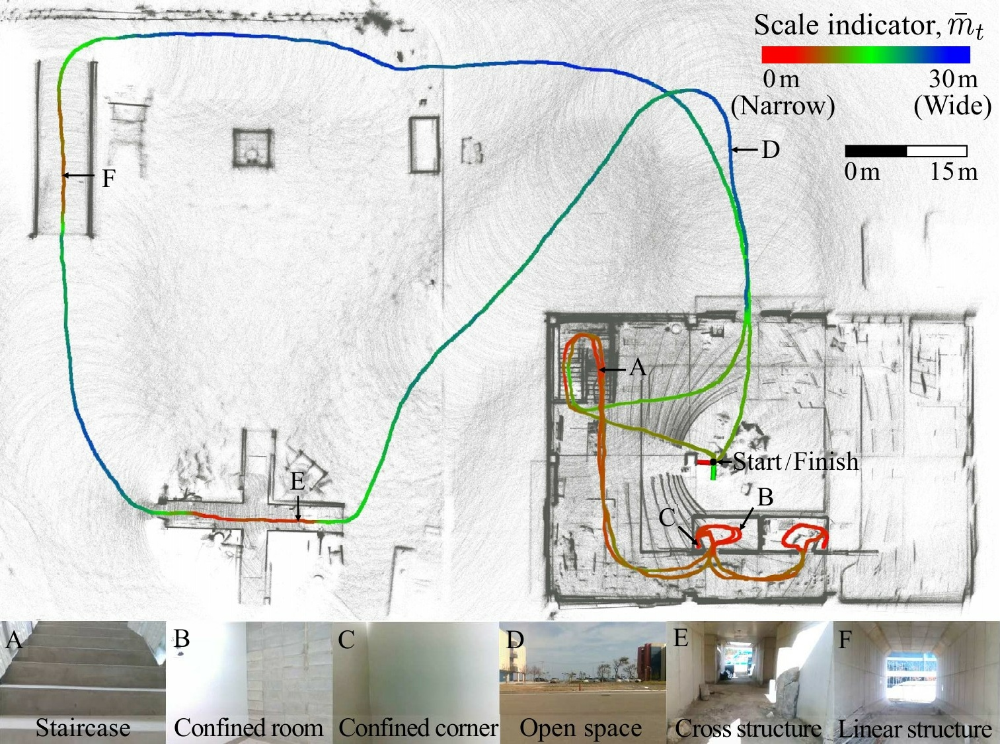
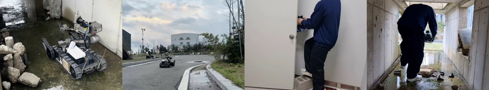
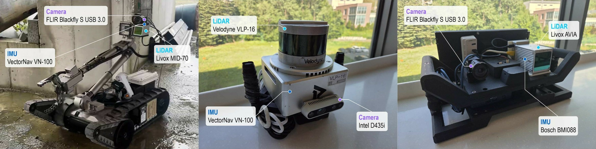
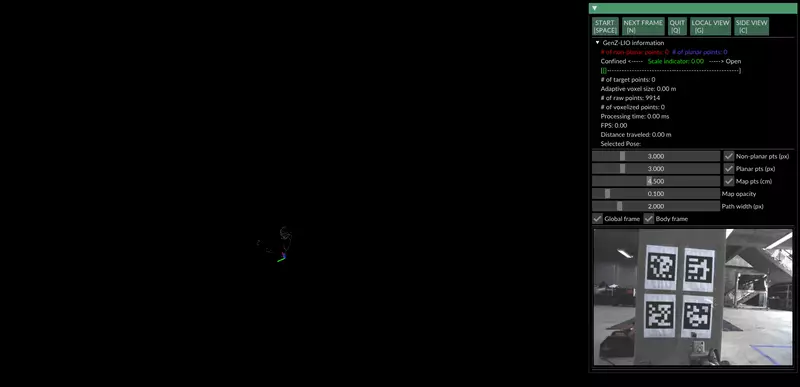
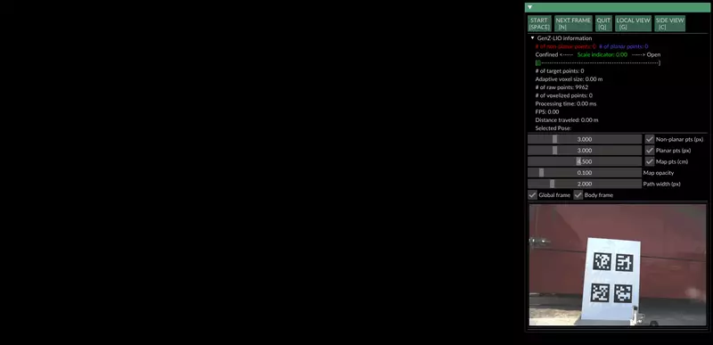
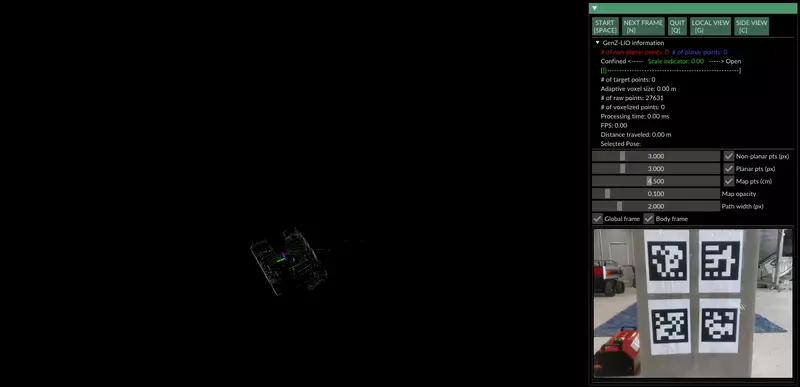
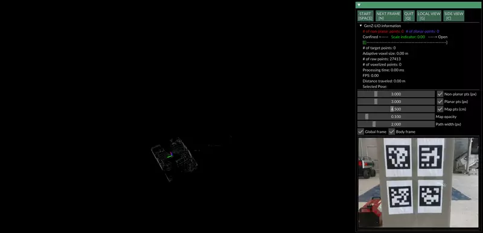
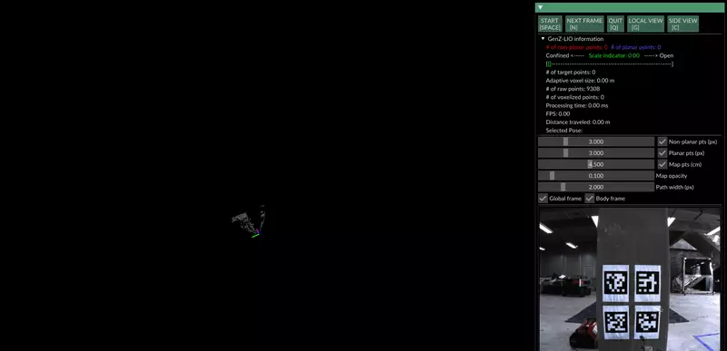
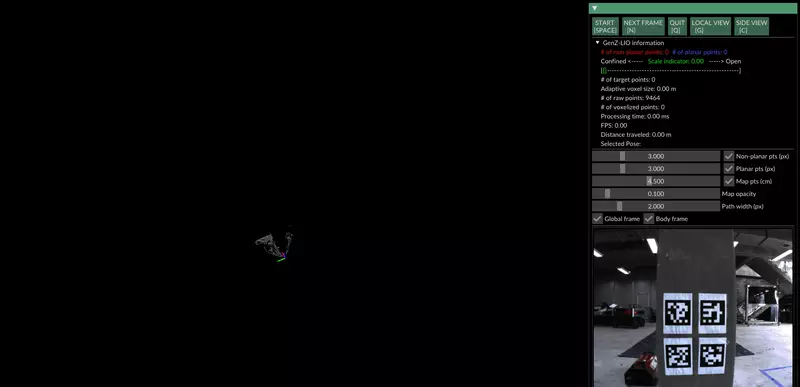

<h1 align="center">NarrowWide Dataset</h1>

<p align="center">
  <a href="https://arxiv.org/abs/2603.16273"></a>
  <a href="https://github.com/cocel-postech/genz-lio/tree/master/cpp/genz_lio"></a>
  <a href="https://github.com/cocel-postech/genz-lio/blob/master/python/README.md"></a>
  <a href="#data-format"></a>
  <a href="#data-format"></a>
  <a href="LICENSE"></a>
  <!-- TODO: badges for GenZ-LIO code and YouTube -->
</p>

A LiDAR-inertial dataset with frequent transitions between confined and open spaces, presented in
**[GenZ-LIO](https://github.com/cocel-postech/genz-lio): Generalizable LiDAR-Inertial Odometry Beyond Confined–Open Boundaries**.

<!-- TODO: temporary hero (paper Fig. 1); replace with the overview photo of the acquisition environment -->
<p align="center">
  <br>
  <em>Estimated trajectory and mapping result of GenZ-LIO on the Handheld-A-01 sequence of our NarrowWide dataset.</em>
</p>

## Overview

Existing datasets often offer limited coverage of *repeated* transitions between confined and open
spaces. NarrowWide was collected at disaster-response and rough-terrain testbeds to capture these
transitions across a wide range of spatial scales, including narrow passages, open terrain, and
artificial obstacles.

- **6 sequences** from **3 platforms** with different LiDAR sensors (Livox MID-70, Velodyne VLP-16, Livox AVIA)
- **6–10 confined–open transitions** per sequence, from passages as narrow as 0.3 m to open areas wider than 100 m
- Handheld sequences cover overlapping areas as well as spaces too narrow for the tracked robot
- **6-DoF ground truth** from map-based localization against a survey-grade prior map

<p align="center">
  <br>
  <em>Field experiments across different spatial scales using the tracked robot and handheld platforms.</em>
</p>

## Platforms and Sensors

<p align="center">
  <br>
  <em>Platforms used for data collection: a tracked robot and two handheld devices.</em>
</p>

<table>
  <thead>
    <tr><th>Component</th><th>Property</th><th>Tracked robot</th><th>Handheld&nbsp;A</th><th>Handheld&nbsp;B</th></tr>
  </thead>
  <tbody>
    <tr><th colspan="2">Platform</th><td align="center">Teledyne FLIR<br>PackBot&nbsp;510</td><td align="center">Handheld</td><td align="center">Handheld</td></tr>
    <tr><th colspan="2">Sequences</th><td align="center">Tracked&#8209;01<br>Tracked&#8209;02</td><td align="center">Handheld&#8209;A&#8209;01<br>Handheld&#8209;A&#8209;02</td><td align="center">Handheld&#8209;B&#8209;01<br>Handheld&#8209;B&#8209;02</td></tr>
  </tbody>
  <tbody>
    <tr><th rowspan="4">LiDAR</th><td>Model</td><td align="center">Livox&nbsp;MID&#8209;70</td><td align="center">Velodyne&nbsp;VLP&#8209;16</td><td align="center">Livox&nbsp;AVIA</td></tr>
    <tr><td>Field of view</td><td align="center">70.4°&nbsp;circular</td><td align="center">360°&nbsp;×&nbsp;30°</td><td align="center">70.4°&nbsp;×&nbsp;77.2°</td></tr>
    <tr><td>Max. range</td><td align="center">260&nbsp;m</td><td align="center">100&nbsp;m</td><td align="center">450&nbsp;m</td></tr>
    <tr><td>Rate</td><td align="center">10&nbsp;Hz</td><td align="center">10&nbsp;Hz</td><td align="center">10&nbsp;Hz</td></tr>
  </tbody>
  <tbody>
    <tr><th rowspan="2">IMU</th><td>Model</td><td align="center">VectorNav&nbsp;VN&#8209;100</td><td align="center">VectorNav&nbsp;VN&#8209;100</td><td align="center">Bosch&nbsp;BMI088¹</td></tr>
    <tr><td>Rate</td><td align="center">200&nbsp;Hz</td><td align="center">200&nbsp;Hz</td><td align="center">200&nbsp;Hz</td></tr>
  </tbody>
  <tbody>
    <tr><th rowspan="3">Camera</th><td>Model</td><td align="center">FLIR&nbsp;Blackfly&nbsp;S</td><td align="center">Intel&nbsp;D435i</td><td align="center">FLIR&nbsp;Blackfly&nbsp;S</td></tr>
    <tr><td>Resolution [px]</td><td align="center">1600&nbsp;×&nbsp;1100</td><td align="center">640&nbsp;×&nbsp;480</td><td align="center">1280&nbsp;×&nbsp;1024</td></tr>
    <tr><td>Rate</td><td align="center">30&nbsp;Hz</td><td align="center">30&nbsp;Hz</td><td align="center">30&nbsp;Hz</td></tr>
  </tbody>
</table>

Field of view is horizontal × vertical, except for the circular field of view of the MID-70.
¹ The BMI088 is built into the Livox AVIA.

Camera images are provided for visualization; the odometry pipeline evaluated in the paper does not use them.

## Sequences

| Sequence | Distance<br>[m] | Duration<br>[s] | Min. width<br>[m] | Transitions | Size<br>[GB] | Download |
|---|:-:|:-:|:-:|:-:|:-:|:-:|
| Tracked&#8209;01 | 265.7 | 621.0 | 1.0 | 8 | 4.3 | [ROS&nbsp;1](https://postechackr-my.sharepoint.com/:u:/g/personal/daehanlee_postech_ac_kr/IQA4AHBzhh3qS6xIHQF84-RtAbrQJVm9aRoNGMm6HfcEiOw?e=09pz0p)&nbsp;/&nbsp;[ROS&nbsp;2](https://postechackr-my.sharepoint.com/:f:/g/personal/daehanlee_postech_ac_kr/IgAvjqKHGOMUTLM7_vLu9K_YAUBP0PyhCi-R3RgeJdMlW1I?e=NCppBu) |
| Tracked&#8209;02 | 269.2 | 578.2 | 1.0 | 8 | 3.5 | [ROS&nbsp;1](https://postechackr-my.sharepoint.com/:u:/g/personal/daehanlee_postech_ac_kr/IQA2r7SoH2PQTpcvQu_bvIurAfGQ3bZUIAyy05c0Bca9yBo?e=yCMP5I)&nbsp;/&nbsp;[ROS&nbsp;2](https://postechackr-my.sharepoint.com/:f:/g/personal/daehanlee_postech_ac_kr/IgDRjJwjRZvATKGtZidoxJU1AYtcVbRR_Z_p7uRHvLwoKSc?e=wkt74P) |
| Handheld&#8209;A&#8209;01 | 263.0 | 521.9 | 0.3 | 6 | 2.9 | [ROS&nbsp;1](https://postechackr-my.sharepoint.com/:u:/g/personal/daehanlee_postech_ac_kr/IQAb43oMXKEwQKTbC-Zu42QYAc_AoHC8cAJRArNo-oBob5E?e=Z9tHju)&nbsp;/&nbsp;[ROS&nbsp;2](https://postechackr-my.sharepoint.com/:f:/g/personal/daehanlee_postech_ac_kr/IgApH9pKKONmT7-3OxODf5uOAX7KKJ4VgvGphSARHFX7jB0?e=FBN5Xd) |
| Handheld&#8209;A&#8209;02 | 244.9 | 402.4 | 0.3 | 6 | 2.1 | [ROS&nbsp;1](https://postechackr-my.sharepoint.com/:u:/g/personal/daehanlee_postech_ac_kr/IQCdv6-8x2W0TILkwzA41X9kASdiW8Aihlb1P4wR5782giE?e=ah3bhJ)&nbsp;/&nbsp;[ROS&nbsp;2](https://postechackr-my.sharepoint.com/:f:/g/personal/daehanlee_postech_ac_kr/IgBU8rEUxjN4SanTy4vGfKMGAZHD8Vsl5JfG51_DB3M3tVM?e=k8B4P0) |
| Handheld&#8209;B&#8209;01 | 408.7 | 636.0 | 0.5 | 10 | 5.8 | [ROS&nbsp;1](https://postechackr-my.sharepoint.com/:u:/g/personal/daehanlee_postech_ac_kr/IQALlTIxeJjrSL1JJDbmAq8KAR6lupBq1n6l2-LnurJmxiM?e=3RTY0h)&nbsp;/&nbsp;[ROS&nbsp;2](https://postechackr-my.sharepoint.com/:f:/g/personal/daehanlee_postech_ac_kr/IgBjMu8Oy_YuTIQq-A8GiRwJAVNoJ_imDBS_4NihmX-wZjw?e=bWBqD8) |
| Handheld&#8209;B&#8209;02 | 415.9 | 529.1 | 0.5 | 8 | 4.8 | [ROS&nbsp;1](https://postechackr-my.sharepoint.com/:u:/g/personal/daehanlee_postech_ac_kr/IQCFVHg0TlaxTauhxuHX4rnyAZ-NzmnHsPgftcC77nTxSmk?e=IVhygw)&nbsp;/&nbsp;[ROS&nbsp;2](https://postechackr-my.sharepoint.com/:f:/g/personal/daehanlee_postech_ac_kr/IgAb6KkoMPZKQJdDtWF_QBmqAcK0cVV18eMbcWHf1NLokw8?e=L9Cl4u) |

**Min. width** is the width of the narrowest space traversed. **Transitions** counts transitions between
confined and open spaces. **Size** refers to the ROS 2 bag; the six bags total 23.5 GB.

All sequences were recorded on 6 November 2025. Each sequence forms a loop, returning to its starting
position, and includes open areas wider than 100 m.

<table>
  <tr>
    <td align="center" width="50%"><a href="fig/Tracked-01.gif" title="Open the full-resolution GIF"></a><br><b>Tracked-01</b><br><a href="https://youtu.be/mfNbzXGq0k4">▶ Camera video</a></td>
    <td align="center" width="50%"><a href="fig/Tracked-02.gif" title="Open the full-resolution GIF"></a><br><b>Tracked-02</b><br><a href="https://youtu.be/2pklu5BBDGU">▶ Camera video</a></td>
  </tr>
  <tr>
    <td align="center" width="50%"><a href="fig/Handheld-A-01.gif" title="Open the full-resolution GIF"></a><br><b>Handheld-A-01</b><br><a href="https://youtu.be/HtsVLIKBW2k">▶ Camera video</a></td>
    <td align="center" width="50%"><a href="fig/Handheld-A-02.gif" title="Open the full-resolution GIF"></a><br><b>Handheld-A-02</b><br><a href="https://youtu.be/p8Q2ib8B6yw">▶ Camera video</a></td>
  </tr>
  <tr>
    <td align="center" width="50%"><a href="fig/Handheld-B-01.gif" title="Open the full-resolution GIF"></a><br><b>Handheld-B-01</b><br><a href="https://youtu.be/Uhf_Ahj7aQU">▶ Camera video</a></td>
    <td align="center" width="50%"><a href="fig/Handheld-B-02.gif" title="Open the full-resolution GIF"></a><br><b>Handheld-B-02</b><br><a href="https://youtu.be/jT8D495zCyo">▶ Camera video</a></td>
  </tr>
</table>
<p align="center"><em>Mapping results from GenZ-LIO on each sequence. Click a preview to open the full-resolution GIF.</em></p>

## Calibration

Calibration was performed using
[LI-Init](https://github.com/hku-mars/LiDAR_IMU_Init),
[FAST-Calib](https://github.com/hku-mars/FAST-Calib),
[FAST-Calib2](https://github.com/xuankuzcr/FAST-Calib2),
[livox_camera_calib](https://github.com/hku-mars/livox_camera_calib), and
[lidar_camera_calibration](https://github.com/ankitdhall/lidar_camera_calibration).
We thank the authors and contributors for sharing their calibration tools with the community.

**Download**: [Calibration](https://postechackr-my.sharepoint.com/:f:/g/personal/daehanlee_postech_ac_kr/IgB9tGmdTEBCS60Tw-nqTScqAer-OYUd2IOSmXGIqD3MjWY?e=g9afaX)

## Ground Truth

Ground truth trajectories are generated by localizing against a prior map, following an approach
inspired by the ground truth system of the Newer College dataset:

1. A high-resolution prior map of the environment is built with a survey-grade 3D imaging laser scanner (Leica BLK360).
2. Globally consistent 6-DoF trajectories are obtained by adapting [PALoc](https://github.com/JokerJohn/PALoc) to localize each sequence against the prior map.
3. Segments with unstable localization undergo additional scan-to-map refinement.

The ground truth of each sequence is provided as a text file in the
[TUM format](https://cvg.cit.tum.de/data/datasets/rgbd-dataset/file_formats):

```
timestamp tx ty tz qx qy qz qw
```

Each row contains a timestamp in seconds, a position in meters, and a unit quaternion in `(x, y, z, w)` order.
The poses describe the IMU of each platform: the VectorNav VN-100 on the tracked robot and Handheld A,
and the built-in BMI088 on Handheld B.

**Download**: [Ground truth](https://postechackr-my.sharepoint.com/:f:/g/personal/daehanlee_postech_ac_kr/IgClqNbkU4MtT67_PL538cVAAWcpxN64P6rbKCSy2asyHA8?e=czTlpE)

## Data Format

Each sequence is provided as a ROS 1 bag and an uncompressed ROS 2 bag with SQLite3 storage.
Both formats contain the same topics.

The tables below use short message type names. In ROS 2, `CustomMsg` is
`livox_ros_driver2/msg/CustomMsg`; all other types use the `sensor_msgs/msg/` prefix
(e.g. `sensor_msgs/msg/Imu`). ROS 1 omits `/msg` from these names
(e.g. `livox_ros_driver2/CustomMsg` and `sensor_msgs/Imu`).

### Tracked robot

| Sensor | Topic | Message type |
|---|---|---|
| LiDAR | `/livox/lidar` | `CustomMsg` |
| IMU | `/vectornav/IMU` | `Imu` |
| Camera | `/camera/image_color/compressed` | `CompressedImage` |
| Camera info | `/camera/camera_info` | `CameraInfo` |

**Frame IDs:** LiDAR: `livox`; IMU: `vectornav`; camera and camera info: `camera`.

### Handheld A

| Sensor | Topic | Message type |
|---|---|---|
| LiDAR | `/velodyne_points` | `PointCloud2` |
| IMU | `/vectornav/IMU` | `Imu` |
| Camera | `/camera/color/image_raw/compressed` | `CompressedImage` |
| Camera info | `/camera/color/camera_info` | `CameraInfo` |

**Frame IDs:** LiDAR: `velodyne`; IMU: `vectornav`; camera and camera info: `camera_color_optical_frame`.

### Handheld B

| Sensor | Topic | Message type |
|---|---|---|
| LiDAR | `/livox/lidar` | `CustomMsg` |
| IMU | `/livox/imu` | `Imu` |
| Camera | `/camera/image_color/compressed` | `CompressedImage` |

**Frame IDs:** LiDAR and IMU: `livox_frame`; camera: `camera`.

### Playback notes

- **LiDAR**: Livox point clouds use the `CustomMsg` type of
  [`livox_ros_driver2`](https://github.com/Livox-SDK/livox_ros_driver2), so playing the Tracked and
  Handheld B bags requires that package to be built. It supports both ROS 1 and ROS 2.
  Velodyne point clouds include per-point `ring` and `time` fields.
- **Camera**: images are JPEG-compressed. Handheld B has no `camera_info` topic.
- Message definitions are embedded in each bag.

## Benchmark

Absolute trajectory error (ATE) on NarrowWide, reported as RMSE in meters.
**Bold** indicates the lowest error in each sequence. **×** indicates divergence (ATE RMSE > 200 m);
**–** indicates that the method does not support the sequence's LiDAR sensor.
For benchmark results on other datasets, see the [GenZ-LIO paper](https://arxiv.org/abs/2603.16273).

<!-- TODO: link the GenZ-LIO repository (it has the NarrowWide configs) once it is public -->

<table>
  <thead>
    <tr><th>Method</th><th>Tracked&#8209;01</th><th>Tracked&#8209;02</th><th>Handheld&#8209;A&#8209;01</th><th>Handheld&#8209;A&#8209;02</th><th>Handheld&#8209;B&#8209;01</th><th>Handheld&#8209;B&#8209;02</th></tr>
  </thead>
  <tbody>
    <tr><td>FAST-LIO2</td><td align="center">0.23</td><td align="center">×</td><td align="center">×</td><td align="center">×</td><td align="center">1.45</td><td align="center">3.17</td></tr>
    <tr><td>Faster-LIO</td><td align="center"><strong>0.11</strong></td><td align="center"><strong>0.11</strong></td><td align="center">×</td><td align="center">×</td><td align="center">0.32</td><td align="center">×</td></tr>
    <tr><td>AdaLIO</td><td align="center">0.17</td><td align="center">×</td><td align="center">0.47</td><td align="center">0.25</td><td align="center">6.61</td><td align="center">2.03</td></tr>
    <tr><td>Point-LIO</td><td align="center">1.48</td><td align="center">0.57</td><td align="center">0.20</td><td align="center">0.32</td><td align="center">×</td><td align="center">×</td></tr>
    <tr><td>LIO-EKF</td><td align="center">–</td><td align="center">–</td><td align="center">×</td><td align="center">×</td><td align="center">–</td><td align="center">–</td></tr>
    <tr><td>DLIO</td><td align="center">×</td><td align="center">×</td><td align="center">×</td><td align="center">×</td><td align="center">×</td><td align="center">×</td></tr>
    <tr><td>iG-LIO</td><td align="center">0.28</td><td align="center">0.18</td><td align="center">2.26</td><td align="center">0.58</td><td align="center">×</td><td align="center">×</td></tr>
    <tr><td>PV-LIO (baseline)</td><td align="center">3.71</td><td align="center">×</td><td align="center">×</td><td align="center">×</td><td align="center">×</td><td align="center">×</td></tr>
    <tr><td>Baseline w/ adap. vox.</td><td align="center">0.21</td><td align="center">0.20</td><td align="center">0.22</td><td align="center">0.28</td><td align="center">0.24</td><td align="center">0.67</td></tr>
    <tr><td>Baseline w/ hybrid-metric</td><td align="center">0.24</td><td align="center">0.23</td><td align="center"><strong>0.18</strong></td><td align="center">0.22</td><td align="center">0.38</td><td align="center">2.07</td></tr>
    <tr><td>GenZ-LIO (ours)</td><td align="center">0.16</td><td align="center">0.12</td><td align="center">0.19</td><td align="center"><strong>0.15</strong></td><td align="center"><strong>0.15</strong></td><td align="center"><strong>0.17</strong></td></tr>
  </tbody>
</table>

## Citation

If you use this dataset, please cite:

```bibtex
@article{lee2026genzlio,
  title   = {{GenZ-LIO}: Generalizable {LiDAR}-Inertial Odometry Beyond Confined--Open Boundaries},
  author  = {Lee, Daehan and Lim, Hyungtae and Kim, Seongjun and Rho, Soonbin and Lee, Changhyeon and
             Park, Sanghyun and Hong, Junwoo and Choi, Eunseon and Jo, Hyunyoung and Han, Soohee},
  journal = {arXiv preprint arXiv:2603.16273},
  year    = {2026}
}
```

<!-- TODO: update to the final venue after publication -->

## License

The NarrowWide dataset is released under the [MIT License](LICENSE).

## Contact

For questions and bugs, open an [issue](https://github.com/cocel-postech/NarrowWide/issues) or contact us:

- [Daehan Lee](https://github.com/Daehan2Lee) :envelope: daehanlee `at` postech `dot` ac `dot` kr
- [Sanghyun Park](https://github.com/SanghyunPark01) :envelope: pash0302 `at` postech `dot` ac `dot` kr
