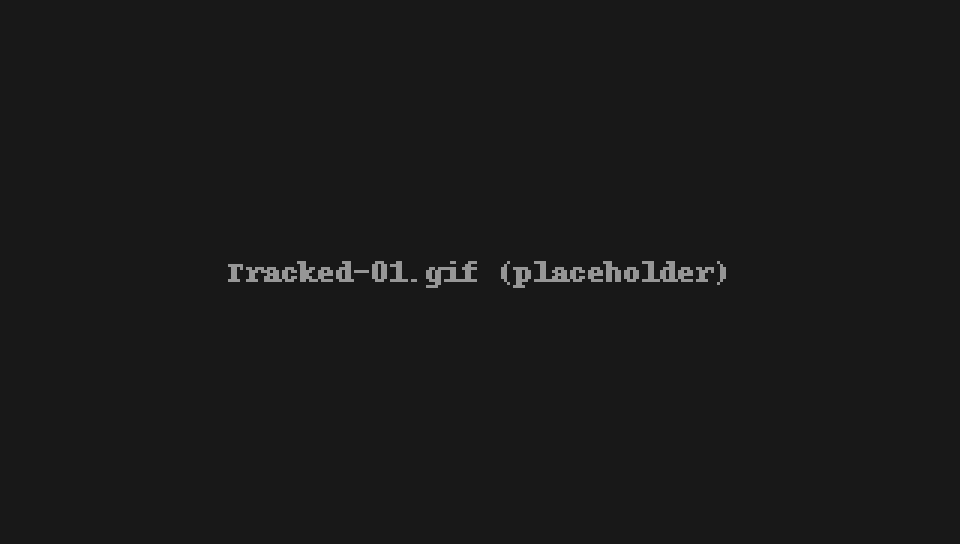
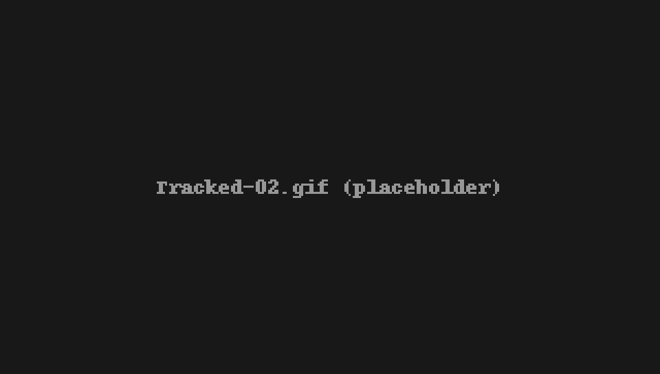
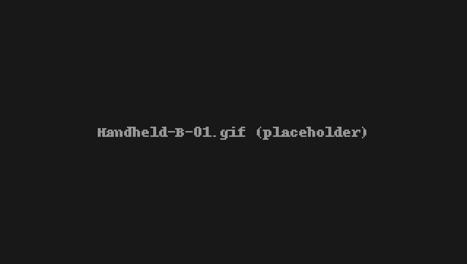

<h1 align="center">NarrowWide Dataset</h1>

<p align="center">
  <a href="https://arxiv.org/abs/2603.16273"></a>
  <a href="https://github.com/cocel-postech/genz-lio/tree/master/cpp/genz_lio"></a>
  <a href="https://github.com/cocel-postech/genz-lio/blob/master/python/README.md"></a>
  <a href="#data-format"></a>
  <a href="#data-format"></a>
  <a href="LICENSE"></a>
  <!-- TODO: badges for GenZ-LIO code and YouTube -->
</p>

A LiDAR-inertial dataset with frequent transitions between confined and open spaces, presented in
**[GenZ-LIO](https://github.com/cocel-postech/genz-lio): Generalizable LiDAR-Inertial Odometry Beyond Confined–Open Boundaries**.

<!-- TODO: temporary hero (paper Fig. 1); replace with the overview photo of the acquisition environment -->
<p align="center">
  <br>
  <em>Estimated trajectory and mapping result of GenZ-LIO on the Handheld-A-01 sequence of our NarrowWide dataset.</em>
</p>

## Overview

Existing datasets that include confined–open transitions often provide limited opportunities to
evaluate *repeated* transitions across substantially different spatial scales. NarrowWide is collected
to capture frequent transitions between open areas and confined structures, in disaster-response and
rough-terrain testbeds that include confined spaces, open terrain, and diverse artificial obstacles.

- **6 sequences** from **3 platforms** with different LiDAR sensors (Livox MID-70, Velodyne VLP-16, Livox AVIA)
- **6–10 confined–open transitions** per sequence, from passages as narrow as 0.3 m to open areas wider than 100 m
- Handheld sequences cover parts of the same environment as well as spaces too confined for the tracked robot to access
- **6-DoF ground truth** from map-based localization against a survey-grade prior map

<p align="center">
  <br>
  <em>Field experiments across different spatial scales using the tracked robot and handheld platforms.</em>
</p>

## Platforms and Sensors

<p align="center">
  <br>
  <em>Platforms used for data collection: a tracked robot and two handheld devices.</em>
</p>

| | Tracked robot | Handheld A | Handheld B |
|---|:-:|:-:|:-:|
| Platform | Teledyne FLIR PackBot 510 | Handheld | Handheld |
| Sequences | Tracked-01, Tracked-02 | Handheld-A-01, Handheld-A-02 | Handheld-B-01, Handheld-B-02 |
| **LiDAR** | Livox MID-70 | Velodyne VLP-16 | Livox AVIA |
| FoV (H × V) | 70.4° circular | 360° × 30° | 70.4° × 77.2° |
| Max. range | 260 m | 100 m | 450 m |
| Frequency | 10 Hz | 10 Hz | 10 Hz |
| **IMU** | VectorNav VN-100 | VectorNav VN-100 | Bosch BMI088 (built into AVIA) |
| Frequency | 200 Hz | 200 Hz | 200 Hz |
| **Camera** | FLIR Blackfly S | Intel D435i | FLIR Blackfly S |
| Resolution | 1600 × 1100 | 640 × 480 | 1280 × 1024 |
| Frequency | 30 Hz | 30 Hz | 30 Hz |

Cameras are mounted for visualization only and are not used by the odometry pipeline in the paper.

## Sequences

| Sequence | Platform | Distance [m] | Duration [s] | Min. width [m] | # of confined–open transitions | Size | Download |
|---|---|:-:|:-:|:-:|:-:|:-:|:-:|
| Tracked-01 | Tracked robot | 265.7 | 621.0 | 1.0 | 8 | 4.3 GB | [ROS1]()/[ROS2]() |
| Tracked-02 | Tracked robot | 269.2 | 578.2 | 1.0 | 8 | 3.5 GB | [ROS1]()/[ROS2]() |
| Handheld-A-01 | Handheld A | 263.0 | 521.9 | 0.3 | 6 | 2.9 GB | [ROS1]()/[ROS2]() |
| Handheld-A-02 | Handheld A | 244.9 | 402.4 | 0.3 | 6 | 2.1 GB | [ROS1]()/[ROS2]() |
| Handheld-B-01 | Handheld B | 408.7 | 636.0 | 0.5 | 10 | 5.8 GB | [ROS1]()/[ROS2]() |
| Handheld-B-02 | Handheld B | 415.9 | 529.1 | 0.5 | 8 | 4.8 GB | [ROS1]()/[ROS2]() |

The minimum width is the width of the narrowest space traversed in each sequence; the widest open areas
traversed exceed 100 m in all sequences. Every sequence returns to its starting position, forming a loop.
All sequences were recorded on 6 November 2025. Size is the size of the ROS 2 bag (23.5 GB in total).

<table>
  <tr>
    <td align="center" width="50%"><br><b>Tracked-01</b><br><a href="https://youtu.be/mfNbzXGq0k4">▶ Camera video</a></td>
    <td align="center" width="50%"><br><b>Tracked-02</b><br><a href="https://youtu.be/2pklu5BBDGU">▶ Camera video</a></td>
  </tr>
  <tr>
    <td align="center" width="50%"><br><b>Handheld-A-01</b><br><a href="https://youtu.be/HtsVLIKBW2k">▶ Camera video</a></td>
    <td align="center" width="50%"><br><b>Handheld-A-02</b><br><a href="https://youtu.be/p8Q2ib8B6yw">▶ Camera video</a></td>
  </tr>
  <tr>
    <td align="center" width="50%"><br><b>Handheld-B-01</b><br><a href="https://youtu.be/Uhf_Ahj7aQU">▶ Camera video</a></td>
    <td align="center" width="50%"><br><b>Handheld-B-02</b><br><a href="https://youtu.be/jT8D495zCyo">▶ Camera video</a></td>
  </tr>
</table>
<p align="center"><em>GenZ-LIO mapping on each sequence, recorded from the same viewpoint.</em></p>

## Data Format

Each sequence is released as both a ROS 1 bag and a ROS 2 bag (sqlite3 storage, uncompressed). Both
contain the same topics; the ROS 1 message types are the ROS 2 types below without `/msg`
(e.g. `sensor_msgs/Imu`, `livox_ros_driver2/CustomMsg`).

<table>
  <tr><th>Platform</th><th>Sensor</th><th>Topic</th><th>Message type (ROS 2)</th><th>Frame ID</th></tr>
  <tr><td rowspan="4">Tracked robot</td><td>LiDAR</td><td><code>/livox/lidar</code></td><td><code>livox_ros_driver2/msg/CustomMsg</code></td><td><code>livox</code></td></tr>
  <tr><td>IMU</td><td><code>/vectornav/IMU</code></td><td><code>sensor_msgs/msg/Imu</code></td><td><code>vectornav</code></td></tr>
  <tr><td>Camera</td><td><code>/camera/image_color/compressed</code></td><td><code>sensor_msgs/msg/CompressedImage</code></td><td><code>camera</code></td></tr>
  <tr><td>Camera info</td><td><code>/camera/camera_info</code></td><td><code>sensor_msgs/msg/CameraInfo</code></td><td><code>camera</code></td></tr>
  <tr><td rowspan="4">Handheld A</td><td>LiDAR</td><td><code>/velodyne_points</code></td><td><code>sensor_msgs/msg/PointCloud2</code></td><td><code>velodyne</code></td></tr>
  <tr><td>IMU</td><td><code>/vectornav/IMU</code></td><td><code>sensor_msgs/msg/Imu</code></td><td><code>vectornav</code></td></tr>
  <tr><td>Camera</td><td><code>/camera/color/image_raw/compressed</code></td><td><code>sensor_msgs/msg/CompressedImage</code></td><td><code>camera_color_optical_frame</code></td></tr>
  <tr><td>Camera info</td><td><code>/camera/color/camera_info</code></td><td><code>sensor_msgs/msg/CameraInfo</code></td><td><code>camera_color_optical_frame</code></td></tr>
  <tr><td rowspan="3">Handheld B</td><td>LiDAR</td><td><code>/livox/lidar</code></td><td><code>livox_ros_driver2/msg/CustomMsg</code></td><td><code>livox_frame</code></td></tr>
  <tr><td>IMU</td><td><code>/livox/imu</code></td><td><code>sensor_msgs/msg/Imu</code></td><td><code>livox_frame</code></td></tr>
  <tr><td>Camera</td><td><code>/camera/image_color/compressed</code></td><td><code>sensor_msgs/msg/CompressedImage</code></td><td><code>camera</code></td></tr>
</table>

- **LiDAR**: Livox point clouds use the `CustomMsg` type of
  [`livox_ros_driver2`](https://github.com/Livox-SDK/livox_ros_driver2), so playing the Tracked and
  Handheld B bags requires that package to be built (it supports both ROS 1 and ROS 2).
  Velodyne point clouds include per-point `ring` and `time` fields.
- **Camera**: images are JPEG-compressed. Handheld B has no `camera_info` topic.
- Message definitions are embedded in each bag.

## Calibration

Calibration parameters (LiDAR–IMU extrinsics and camera intrinsics/extrinsics) are currently being
verified and will be released once verification is complete. Until then, do not rely on the
`camera_info` messages recorded in the bags.

**Download**: [Calibration]()

<!-- TODO: add verified calibration files and how they were obtained -->

## Ground Truth

Ground truth trajectories are generated with a map-based trajectory estimation procedure, motivated by
the GT system of the Newer College dataset:

1. A high-resolution prior map of the environment is built with a survey-grade 3D imaging laser scanner (Leica BLK360).
2. Globally consistent 6-DoF trajectories are obtained by adapting [PALoc](https://github.com/JokerJohn/PALoc) to localize each sequence against the prior map.
3. For segments where map-based localization became unstable, additional scan-to-map refinement is performed.

The ground truth of each sequence is provided as a text file in the
[TUM format](https://cvg.cit.tum.de/data/datasets/rgbd-dataset/file_formats):

```
timestamp tx ty tz qx qy qz qw
```

with the timestamp in seconds, the position in meters, and the orientation as a unit quaternion. Poses are
given for the IMU frame of each platform (VectorNav VN-100 on the tracked robot and Handheld A, the built-in
BMI088 on Handheld B).

**Download**: [Ground truth]()

## Benchmark

ATE (RMSE, m) on NarrowWide, from the benchmark table of the paper. **Bold**: best per sequence.
× : divergent run (ATE RMSE > 200 m). – : the method cannot process the LiDAR sensor used in the sequence.
All methods use a voxel size of 0.25 m on these sequences.

<!-- TODO: link the GenZ-LIO repository (it has the NarrowWide configs) once it is public -->

| Method | Tracked-01 | Tracked-02 | Handheld-A-01 | Handheld-A-02 | Handheld-B-01 | Handheld-B-02 |
|---|:-:|:-:|:-:|:-:|:-:|:-:|
| FAST-LIO2 | 0.23 | × | × | × | 1.45 | 3.17 |
| Faster-LIO | **0.11** | **0.11** | × | × | 0.32 | × |
| AdaLIO | 0.17 | × | 0.47 | 0.25 | 6.61 | 2.03 |
| Point-LIO | 1.48 | 0.57 | 0.20 | 0.32 | × | × |
| LIO-EKF | – | – | × | × | – | – |
| DLIO | × | × | × | × | × | × |
| iG-LIO | 0.28 | 0.18 | 2.26 | 0.58 | × | × |
| PV-LIO (baseline) | 3.71 | × | × | × | × | × |
| Baseline w/ adap. vox. | 0.21 | 0.20 | 0.22 | 0.28 | 0.24 | 0.67 |
| Baseline w/ hybrid-metric | 0.24 | 0.23 | **0.18** | 0.22 | 0.38 | 2.07 |
| GenZ-LIO | 0.16 | 0.12 | 0.19 | **0.15** | **0.15** | **0.17** |

## Citation

If you use this dataset, please cite:

```bibtex
@article{lee2026genzlio,
  title   = {{GenZ-LIO}: Generalizable {LiDAR}-Inertial Odometry Beyond Confined--Open Boundaries},
  author  = {Lee, Daehan and Lim, Hyungtae and Kim, Seongjun and Rho, Soonbin and Lee, Changhyeon and
             Park, Sanghyun and Hong, Junwoo and Choi, Eunseon and Jo, Hyunyoung and Han, Soohee},
  journal = {arXiv preprint arXiv:2603.16273},
  year    = {2026}
}
```

<!-- TODO: update to the final venue after publication -->

## License

The NarrowWide dataset is released under the [MIT License](LICENSE).

## Contact

> TODO: contact for questions about the dataset.
